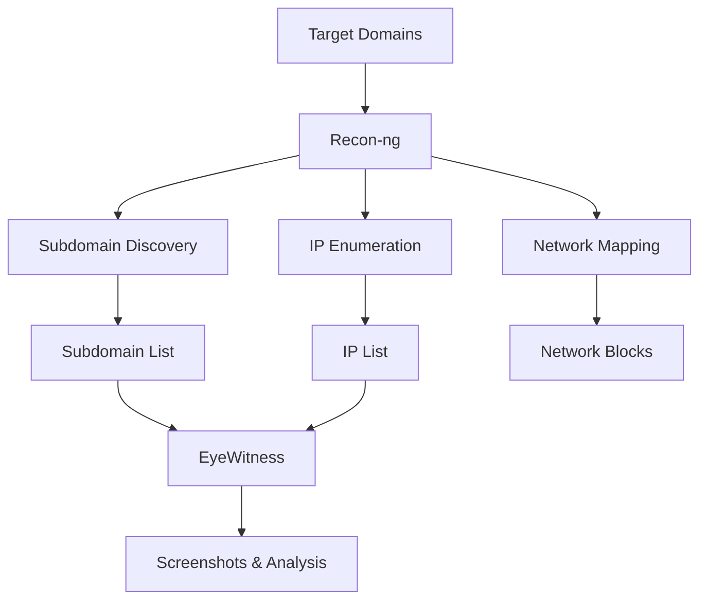

SVM integrates powerful reconnaissance and Open Source Intelligence (OSINT) tools for comprehensive information gathering during the pre-assessment phase. These tools discover subdomains, map infrastructure, gather public information, and capture web application screenshots.

## Available Tools

<CardGroup cols={2}>
  <Card
    title="Recon-ng"
    icon="database"
    href="https://github.com/lanmaster53/recon-ng"
  >
    Modular reconnaissance framework with a database backend for managing intelligence gathering workflows.
  </Card>

  <Card
    title="EyeWitness"
    icon="camera"
    href="https://github.com/ChrisTruncer/EyeWitness"
  >
    Web application screenshot tool with server header detection and default credential identification.
  </Card>
</CardGroup>

## Tool Capabilities

### Recon-ng
Recon-ng is a full-featured reconnaissance framework with module-based architecture:

#### Core Features
- **Workspace Management**: Organize reconnaissance data by project
- **Database Backend**: SQLite database stores all gathered intelligence
- **Module System**: 70+ modules for various OSINT sources
- **API Integration**: Support for 15+ third-party APIs
- **Report Generation**: HTML reports with complete findings
- **Query System**: SQL-based queries for data analysis

#### Integrated Modules
SVM's Recon-ng integration includes the following reconnaissance modules:

**Domain-to-Host Enumeration**
- `netcraft` - Subdomain discovery via Netcraft
- `bing_domain_api` - Microsoft Bing API subdomain search
- `bing_domain_web` - Bing web scraping for subdomains
- `builtwith` - Technology stack and subdomain discovery
- `brute_hosts` - DNS brute-force subdomain enumeration
- `ssl_san` - SSL certificate Subject Alternative Name parsing
- `vpnhunter` - VPN endpoint discovery
- `certificate_transparency` - CT log subdomain discovery
- `google_site_web` - Google search subdomain enumeration
- `hackertarget` - HackerTarget API subdomain lookup
- `mx_spf_ip` - MX and SPF record parsing for IP discovery
- `shodan_hostname` - Shodan hostname search
- `threatcrowd` - ThreatCrowd database subdomain lookup

**Network Block to Host**
- `reverse_resolve` - Reverse DNS resolution of IP ranges
- `shodan_net` - Shodan network block scanning

**Host Enrichment**
- `reverse_resolve` - PTR record resolution
- `resolve` - Forward DNS resolution
- `bing_ip` - Bing IP-based search
- `freegeoip` - IP geolocation
- `ipinfodb` - IP information database lookup
- `ssltools` - SSL certificate analysis

#### API Configuration
Recon-ng supports multiple API keys for enhanced data gathering:
- **Google API** - Google Custom Search
- **Bing API** - Microsoft Bing Search
- **Shodan API** - Shodan device search
- **GitHub API** - GitHub code search
- **BuiltWith API** - Technology profiling
- **FullContact API** - Contact information
- **VirusTotal API** - Threat intelligence
- **Censys API** - Internet-wide scanning data

<Info>
  **API Keys**: Configure API keys in the script file before execution. Most modules work without API keys but provide limited results. API keys significantly enhance data coverage.
</Info>

#### Execution Workflow
1. **Workspace Creation**: Creates isolated workspace per project
2. **Domain Addition**: Adds target domains to database
3. **Module Execution**: Runs 15+ reconnaissance modules sequentially
4. **Data Correlation**: Cross-references findings across modules
5. **Report Generation**: Produces HTML report and text exports
6. **Data Export**: Exports networks, IPs, and subdomains separately

#### Output Files
- **HTML Report**: Complete reconnaissance report with all findings
- **Networks List**: Identified network blocks (CIDR notation)
- **IP Addresses**: Unique IP addresses discovered
- **Subdomains**: Complete subdomain list with IP resolution

<Info>
  **Remote Execution**: Recon-ng runs on remote Linux servers via SSH. This enables long-running reconnaissance without tying up local resources. Execution can take 30+ minutes depending on target size.
</Info>

**Script Reference**: [recon_ng_remote.bat](/scripts/recon-ng)

### EyeWitness
EyeWitness captures screenshots and analyzes web applications:

#### Core Features
- **Web Screenshots**: Automated screenshot capture of web applications
- **Server Headers**: HTTP header analysis and fingerprinting
- **Default Credentials**: Detection of default login pages
- **Certificate Analysis**: SSL/TLS certificate inspection
- **Active Scanning**: Probes for common vulnerabilities
- **Multi-Threading**: Parallel processing of multiple targets
- **Report Generation**: HTML report with inline screenshots

#### Detection Capabilities
- Default web server pages (Apache, IIS, Nginx)
- Default application installations (WordPress, Joomla, etc.)
- Login portals and authentication pages
- Administrative interfaces
- Potential security issues (HTTP on HTTPS ports, etc.)
- Server version information
- Response timing anomalies

#### Configuration Options
- **Protocol Prepending**: Automatically prepends HTTPS
- **Timeout Settings**: Configurable per-request timeout (default: 20s)
- **Threading**: Concurrent requests (default: 10 threads)
- **User-Agent**: Custom user-agent string
- **Active Scanning**: Optional active vulnerability probing
- **DNS Resolution**: Resolve hostnames before screenshot capture

#### Input Formats
EyeWitness accepts target lists in the following formats:
```
http://example.com
https://example.com:8443
example.com
192.168.1.1
```

#### Execution Workflow
1. **Target Upload**: Uploads target list to remote server
2. **Script Generation**: Creates execution script with parameters
3. **Screenshot Capture**: Captures web application screenshots
4. **Analysis**: Analyzes headers and identifies technologies
5. **Report Compilation**: Generates HTML report with findings
6. **Archive Creation**: Packages screenshots and reports
7. **Download**: Retrieves tar.gz archive to local system

#### Output Structure
```
EyeWitnessReport_<timestamp>/
├── report.html          # Main report with screenshots
├── screens/             # Screenshot images
├── source/              # HTML source code
└── logs/                # Execution logs
```

<Info>
  **Server Requirements**: EyeWitness requires Python and dependencies installed on remote Linux server. Install with: `cd EyeWitness/setup && ./setup.sh`
</Info>

**Script Reference**: [EyeWitness_remote.bat](/scripts/eyewitness)

## Information Gathering Workflow

### Reconnaissance Phase


### Integration Points
1. **Domain Input**: Start with primary target domains
2. **Recon-ng Discovery**: Enumerate all subdomains and IPs
3. **Data Export**: Extract unique web targets
4. **EyeWitness Capture**: Screenshot all discovered web applications
5. **Analysis**: Review reports for interesting targets
6. **Project Import**: Import findings into SVM project

## Use Cases

<AccordionGroup>
  <Accordion title="External Assessment Preparation">
    Before external penetration testing:
    1. Run Recon-ng with target domains
    2. Export discovered subdomains and IPs
    3. Run EyeWitness on discovered targets
    4. Identify interesting applications and technologies
    5. Plan testing scope based on findings
  </Accordion>

  <Accordion title="Attack Surface Mapping">
    For comprehensive asset discovery:
    1. Configure all Recon-ng API keys
    2. Execute full reconnaissance against target organization
    3. Review network blocks and IP ranges
    4. Screenshot all HTTP/HTTPS services
    5. Document exposed services and applications
  </Accordion>

  <Accordion title="Subdomain Takeover Hunting">
    To identify subdomain takeover opportunities:
    1. Use Recon-ng certificate transparency module
    2. Enumerate all subdomains via multiple sources
    3. Check DNS resolution for each subdomain
    4. Use EyeWitness to identify error pages
    5. Investigate unresolved or error-state subdomains
  </Accordion>

  <Accordion title="Technology Profiling">
    For technology stack identification:
    1. Recon-ng BuiltWith module for technology detection
    2. EyeWitness for server header analysis
    3. Screenshot analysis for framework identification
    4. Correlate versions across multiple sources
  </Accordion>
</AccordionGroup>

## Best Practices

<AccordionGroup>
  <Accordion title="API Key Management">
    - Register for API keys from all supported services
    - Store API keys securely (not in version control)
    - Configure API keys in script before execution
    - Monitor API rate limits and usage quotas
    - Rotate API keys periodically for security
  </Accordion>

  <Accordion title="Data Accuracy">
    - Use multiple reconnaissance modules for verification
    - Cross-reference findings across different sources
    - Validate discovered subdomains with DNS resolution
    - Confirm IP ownership before testing
    - Document sources for all intelligence gathered
  </Accordion>

  <Accordion title="Execution Timing">
    - Run reconnaissance during initial project phases
    - Schedule long-running scans during off-hours
    - Monitor remote execution via SSH if needed
    - Allow sufficient time for complete enumeration (30-60 min)
    - Re-run reconnaissance periodically for new assets
  </Accordion>

  <Accordion title="Legal Considerations">
    - Only target authorized domains and networks
    - Respect robots.txt and API terms of service
    - Avoid aggressive scanning that may trigger alerts
    - Document authorization for all reconnaissance activities
    - Use passive techniques when active scanning is not authorized
  </Accordion>

  <Accordion title="Report Analysis">
    - Review EyeWitness report for default credentials
    - Identify high-value targets (admin panels, APIs)
    - Note outdated software versions for exploitation
    - Document unusual or interesting findings
    - Import all findings into SVM project for tracking
  </Accordion>
</AccordionGroup>

## Remote Server Setup

Both tools require Linux servers for execution:

### Recon-ng Setup
```bash
# Clone repository
git clone https://github.com/lanmaster53/recon-ng.git

# Install dependencies
cd recon-ng
pip install -r REQUIREMENTS

# Verify installation
./recon-ng --version
```

### EyeWitness Setup
```bash
# Clone repository
git clone https://github.com/ChrisTruncer/EyeWitness.git

# Run setup script
cd EyeWitness/setup
./setup.sh

# Verify installation
cd ../Python
./EyeWitness.py --help
```

### SVM Remote Access Requirements
- SSH access (port 22)
- Username and password authentication
- plink.exe and pscp.exe (included with SVM)
- Network connectivity to remote server
- Tools installed in known paths

## Output Organization

### Recon-ng Reports
```
<Project>/Documentation/
├── recon-ngReport - <timestamp>.html          # Main report
├── recon-ngReport-Networks - <timestamp>.txt  # Network blocks
├── recon-ngReport-IP - <timestamp>.txt        # IP addresses
└── recon-ngReport-Subdomains - <timestamp>.txt # Subdomain list
```

### EyeWitness Reports
```
<Project>/Documentation/
└── EyeWitnessReport_<timestamp>.tar.gz        # Complete archive
    ├── report.html
    ├── screens/*.png
    ├── source/*.html
    └── logs/*.log
```

## Integration with Other Tools

Information gathering tools feed into other SVM scanners:

### Recon-ng → Web Scanners
Export subdomain list to scan with Acunetix, Burpsuite, Netsparker, or Arachni

### Recon-ng → Service Scanners
Export IP addresses to scan with Qualys, Nessus, OpenVAS, or Nmap

### EyeWitness → Manual Testing
Identify interesting targets for manual security assessment

### Combined Workflow
```
Recon-ng Discovery → Target List → EyeWitness Screenshots → 
Manual Review → Prioritized Targets → Automated Scanning
```

## Next Steps

<CardGroup cols={2}>
  <Card
    title="Web Scanners"
    icon="globe"
    href="/scanners/web-scanners"
  >
    Scan discovered web applications
  </Card>

  <Card
    title="Service Scanners"
    icon="network-wired"
    href="/scanners/service-scanners"
  >
    Scan discovered IP addresses and services
  </Card>
</CardGroup>
