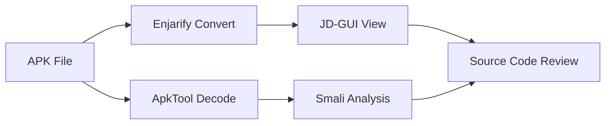
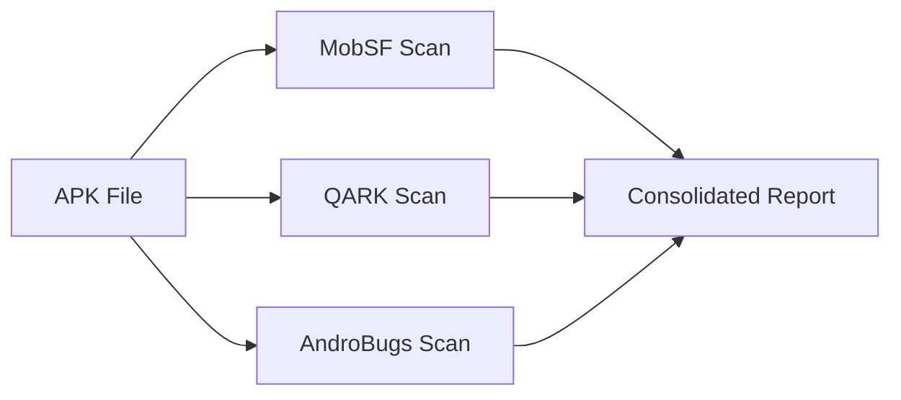

SVM integrates comprehensive Android security testing tools for static analysis, reverse engineering, and vulnerability detection in mobile applications. These tools enable complete APK analysis from decompilation to security scanning.

## Available Tools

<CardGroup cols={2}>
  <Card
    title="ApkTool"
    icon="screwdriver-wrench"
    href="https://ibotpeaches.github.io/Apktool/"
  >
    Reverse engineering tool for Android APK files supporting decode, rebuild, and resource extraction.
  </Card>

  <Card
    title="Enjarify"
    icon="file-zipper"
    href="https://github.com/google/enjarify"
  >
    Google's tool for translating Dalvik bytecode to Java bytecode for analysis with Java tools.
  </Card>

  <Card
    title="JD-GUI"
    icon="eye"
    href="http://jd.benow.ca/"
  >
    Java decompiler with graphical interface for viewing decompiled Java source code from JAR files.
  </Card>

  <Card
    title="MobSF"
    icon="shield-check"
    href="https://github.com/MobSF/Mobile-Security-Framework-MobSF"
  >
    Mobile Security Framework - automated security analysis platform for Android and iOS applications.
  </Card>

  <Card
    title="QARK"
    icon="magnifying-glass"
    href="https://github.com/linkedin/qark"
  >
    Quick Android Review Kit by LinkedIn for finding security vulnerabilities in Android applications.
  </Card>

  <Card
    title="AndroBugs"
    icon="bug"
    href="https://github.com/AndroBugs/AndroBugs_Framework"
  >
    Efficient Android vulnerability scanner finding security vulnerabilities in Android applications.
  </Card>
</CardGroup>

## Tool Capabilities

### ApkTool
ApkTool provides comprehensive APK reverse engineering capabilities:

- **APK Decoding**: Extracts resources to nearly original form
- **Resource Parsing**: Decodes binary XML files to readable text
- **Smali Disassembly**: Converts DEX to Smali intermediate language
- **APK Rebuilding**: Recompiles modified resources back to APK
- **Asset Extraction**: Full access to images, layouts, and manifests

SVM supports both local and remote ApkTool operations:
- Local decoding for quick analysis
- Remote execution via SSH for isolated environments
- Automatic timestamp-based output organization

<Info>
  **Version**: SVM is compatible with ApkTool 2.3.3 and later. The tool requires Java Runtime Environment (JRE) to be installed.
</Info>

**Script Reference**: [apktool scripts](/scripts/apktool)

### Enjarify
Enjarify translates Android applications to Java format for enhanced analysis:

- **Dalvik to Java Conversion**: Translates DEX bytecode to Java bytecode
- **Better Accuracy**: More robust than dex2jar for complex applications
- **JAR Output**: Generates standard JAR files compatible with Java tools
- **Error Handling**: Handles malformed DEX files gracefully

Workflow:
1. Accept APK file as input
2. Extract and convert DEX files to Java bytecode
3. Generate JAR file for use with JD-GUI or other Java analysis tools

<Info>
  **Integration**: Enjarify output JAR files can be directly opened with JD-GUI for source code analysis. Use Enjarify first, then JD-GUI for the complete workflow.
</Info>

**Script Reference**: See [apktool scripts](/scripts/apktool) for Enjarify integration

### JD-GUI
JD-GUI provides visual Java decompilation:

- **Graphical Interface**: User-friendly GUI for browsing decompiled source
- **Syntax Highlighting**: Color-coded Java source code display
- **Class Navigation**: Tree-view of packages and classes
- **Search Functionality**: Find classes, methods, and strings
- **Export Capability**: Save decompiled sources to disk

JD-GUI is the final step in the reverse engineering chain:
```
APK → Enjarify → JAR → JD-GUI → Source Code
```

<Info>
  **Usage**: JD-GUI launches interactively. Pass the JAR file generated by Enjarify to view the decompiled Android application source code.
</Info>

**Script Reference**: See [apktool scripts](/scripts/apktool) for JD-GUI integration

### MobSF
Mobile Security Framework performs comprehensive automated security analysis:

- **Static Analysis**: Code analysis without running the application
- **Malware Detection**: Identifies malicious behavior patterns
- **Manifest Analysis**: Reviews Android manifest for security issues
- **Code Review**: Detects insecure code patterns and APIs
- **Binary Analysis**: Examines native libraries and ELF binaries
- **PDF Reports**: Generates detailed security assessment reports

Security checks include:
- Insecure data storage
- Weak cryptography implementation
- Improper SSL/TLS validation
- Hardcoded secrets and credentials
- Vulnerable third-party libraries
- Excessive permissions
- Debuggable applications

Integration features:
- RESTful API communication
- CSRF token handling
- Automatic report generation
- Support for both local and remote MobSF servers

<Info>
  **Server Setup**: MobSF must be running as a service. Start with: `python /path/to/Mobile-Security-Framework-MobSF/manage.py runserver 0.0.0.0:8000`
</Info>

**Script Reference**: [mobsf.bat](/scripts/mobsf)

### QARK
Quick Android Review Kit by LinkedIn identifies security vulnerabilities:

- **Automated Security Testing**: Scans for common Android vulnerabilities
- **Exploit Generation**: Creates proof-of-concept exploits for findings
- **Manifest Analysis**: Reviews permissions and component exports
- **Source Code Analysis**: Detects insecure coding practices
- **Report Generation**: Comprehensive HTML reports with remediation advice

QARK identifies:
- Exported components (Activities, Services, Broadcast Receivers)
- SQL injection vulnerabilities
- Path traversal issues
- WebView vulnerabilities
- Insecure file permissions
- Tapjacking vulnerabilities

Execution model:
- Remote execution via SSH (interactive)
- Manual completion monitoring
- Compressed report archive (tar.gz)
- Includes logs and exploit code

<Info>
  **Interactive Mode**: QARK requires manual interaction during analysis. The script prompts you to confirm completion before retrieving results.
</Info>

**Script Reference**: [qark.bat](/scripts/qark)

### AndroBugs Framework
AndroBugs performs efficient vulnerability scanning:

- **Fast Scanning**: Quick security assessment compared to MobSF
- **Vulnerability Detection**: Identifies OWASP Mobile Top 10 issues
- **Text Reports**: Detailed findings in plain text format
- **Remote Execution**: SSH-based scanning on Linux servers
- **Severity Ratings**: Critical, High, Medium, Low classifications

Security categories:
- SSL/TLS implementation issues
- Cryptographic vulnerabilities
- Database security problems
- WebView configuration issues
- Component exposure risks
- Intent handling vulnerabilities

<Info>
  **Python Dependency**: AndroBugs requires Python 2.7. Execute via remote Linux server with proper Python environment configured.
</Info>

**Script Reference**: [androbugs_framework.bat](/scripts/androbugs)

## Mobile Analysis Workflow

SVM supports a comprehensive mobile security testing workflow:

### Basic Reverse Engineering


### Security Scanning


## Tool Comparison

| Feature | ApkTool | Enjarify | JD-GUI | MobSF | QARK | AndroBugs |
|---------|---------|----------|--------|-------|------|-----------|
| **Purpose** | Reverse Eng. | DEX→JAR | Decompiler | Security Scan | Security Scan | Security Scan |
| **Input** | APK | APK | JAR | APK | APK | APK |
| **Output** | Smali/Resources | JAR | Source View | PDF Report | HTML+Exploits | Text Report |
| **Speed** | Fast | Fast | Instant | Slow | Medium | Fast |
| **Automation** | Full | Full | Manual | Full | Interactive | Full |
| **Remote Support** | Yes | Yes | No | Yes | Yes | Yes |

## Analysis Strategies

<AccordionGroup>
  <Accordion title="Quick Assessment">
    For rapid security assessment:
    1. Run AndroBugs Framework (fastest)
    2. Review text report for critical/high findings
    3. Run MobSF for detailed analysis of flagged issues
  </Accordion>

  <Accordion title="Deep Code Analysis">
    For comprehensive code review:
    1. ApkTool decode for manifest and resource analysis
    2. Enjarify conversion to JAR format
    3. JD-GUI for source code navigation
    4. Manual code review of security-sensitive areas
  </Accordion>

  <Accordion title="Complete Security Audit">
    For full security assessment:
    1. MobSF for automated vulnerability detection
    2. QARK for exploit generation and verification
    3. AndroBugs for additional vulnerability coverage
    4. ApkTool + Enjarify + JD-GUI for manual review
    5. Consolidate findings in SVM project
  </Accordion>

  <Accordion title="Malware Analysis">
    For suspicious applications:
    1. MobSF static analysis for malware indicators
    2. ApkTool decode to examine permissions and components
    3. JD-GUI source review for malicious code patterns
    4. Manual analysis of native libraries and encrypted assets
  </Accordion>
</AccordionGroup>

## Remote Execution

Most mobile tools support remote execution for resource-intensive operations:

### Benefits
- Offload processing to dedicated analysis servers
- Maintain consistent analysis environments
- Enable distributed analysis across teams
- Isolate potentially malicious applications

### Requirements
- SSH access to remote Linux server
- Tools installed on remote server
- plink.exe and pscp.exe for Windows-to-Linux communication
- Network connectivity between SVM and remote server

### Supported Remote Operations
- ApkTool decode (remote)
- Enjarify conversion (remote)
- MobSF scanning (remote server)
- QARK analysis (remote server)
- AndroBugs scanning (remote server)

## APK Signing and Installation

SVM includes additional mobile tools for APK manipulation:

### Uber APK Signer
Sign modified APK files for installation on devices.

**Script Reference**: See [apktool scripts](/scripts/apktool) for APK signing

### APK Installation
Install signed APKs on connected devices or emulators:
- Local installation via ADB
- Remote installation to device over network

**Script Reference**: See [apktool scripts](/scripts/apktool) for APK installation

### Certificate Installation
Install custom CA certificates for MITM proxy testing.

**Script Reference**: See [apktool scripts](/scripts/apktool) for certificate installation

## Best Practices

<AccordionGroup>
  <Accordion title="Tool Selection">
    - Use MobSF for comprehensive automated scanning
    - Use AndroBugs for quick vulnerability checks
    - Use QARK when proof-of-concept exploits are needed
    - Use ApkTool+Enjarify+JD-GUI for manual code review
  </Accordion>

  <Accordion title="Analysis Environment">
    - Perform analysis in isolated VM or sandbox
    - Use dedicated servers for remote analysis
    - Maintain separate environments for trusted/untrusted APKs
    - Regularly update all analysis tools
  </Accordion>

  <Accordion title="Report Management">
    - All reports are timestamped automatically
    - Store APK files alongside analysis reports
    - Document manual findings in SVM project
    - Archive complete analysis artifacts
  </Accordion>

  <Accordion title="Efficiency">
    - Run multiple scanners in parallel when possible
    - Use remote execution for resource-intensive operations
    - Batch similar APKs for sequential analysis
    - Prioritize tools based on time constraints
  </Accordion>
</AccordionGroup>

## Next Steps

<CardGroup cols={2}>
  <Card
    title="Information Tools"
    icon="magnifying-glass-chart"
    href="/scanners/information-tools"
  >
    Reconnaissance and OSINT gathering tools
  </Card>

  <Card
    title="Android Commands"
    icon="terminal"
    href="/scripts/apktool"
  >
    ADB and device management commands
  </Card>
</CardGroup>
