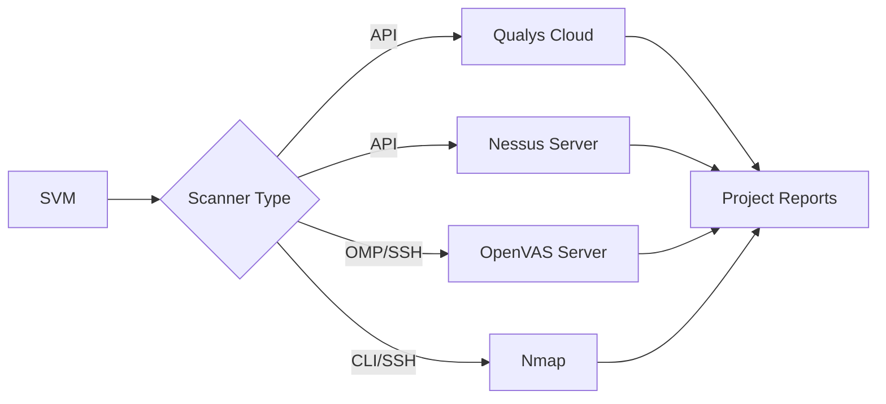

SVM integrates with enterprise-grade and open-source vulnerability scanners to perform comprehensive network and service-level security assessments. These tools identify vulnerabilities in network services, operating systems, and infrastructure components.

## Available Tools

<CardGroup cols={2}>
  <Card
    title="Qualys"
    icon="cloud"
    href="https://www.qualys.com/community-edition/"
  >
    Cloud-based vulnerability management platform supporting both Community and Enterprise editions with automated scanning and reporting.
  </Card>

  <Card
    title="Nessus"
    icon="shield-halved"
    href="https://www.tenable.com/products/nessus/nessus-professional"
  >
    Industry-standard vulnerability scanner from Tenable with comprehensive vulnerability coverage and policy-based scanning.
  </Card>

  <Card
    title="OpenVAS"
    icon="lock-open"
    href="http://www.openvas.org/"
  >
    Open-source vulnerability assessment system providing full-featured network vulnerability scanning.
  </Card>

  <Card
    title="Nmap"
    icon="radar"
    href="https://nmap.org/"
  >
    Network discovery and security auditing tool for port scanning, service detection, and OS fingerprinting.
  </Card>
</CardGroup>

## Tool Capabilities

### Qualys
Qualys provides cloud-based vulnerability management with enterprise-grade features:

- **API-Based Integration**: Full REST API support for scan launch, monitoring, and reporting
- **Scan Appliances**: Support for both external scanning and internal appliances
- **Asset Management**: Automatic asset addition and tracking
- **Policy-Based Scanning**: Custom scan policies per project
- **Automated Reporting**: Multiple report formats and templates
- **Proxy Support**: HTTP proxy configuration for restricted environments

The integration handles:
- Automatic asset registration for new IP addresses
- Real-time scan status monitoring
- Export of both scan results and vulnerability reports
- Rate limiting and API throttling management

<Info>
  **Editions Supported**: Both Qualys Community Edition (free) and Enterprise Edition are supported. Community Edition has API usage limits that SVM automatically manages.
</Info>

**Script Reference**: [qualys_scan.bat](/scripts/qualys)

### Nessus
Nessus integration provides professional-grade vulnerability assessment:

- **RESTful API**: Complete API-based scan management and reporting
- **Policy Management**: Support for custom scan policies and templates
- **Authentication**: Secure token-based authentication
- **Report Formats**: HTML and XML (.nessus) export formats
- **Scan History**: Historical scan tracking and comparison
- **Service Detection**: Automatic detection of running Nessus service

Scan workflow includes:
1. Policy and template UUID retrieval
2. Scan configuration and launch
3. Real-time status monitoring with timeout handling
4. Dual report generation (HTML + XML)
5. Automatic cleanup and session logout

<Info>
  **Requirements**: Nessus Professional or Nessus Manager required. Ensure the Nessus service is running before launching scans: `/etc/init.d/nessusd start`
</Info>

**Script Reference**: [nessus_scan.bat](/scripts/nessus)

### OpenVAS
OpenVAS (Open Vulnerability Assessment System) offers open-source vulnerability scanning:

- **OMP Protocol**: OpenVAS Management Protocol (OMP) integration
- **Report Formats**: Multiple output formats (PDF, XML, HTML, TXT, CSV)
- **Task Management**: Complete scan task lifecycle management
- **Target Configuration**: Flexible target and credential management
- **Remote Execution**: SSH-based remote scanning support
- **Format Discovery**: Automatic report format ID enumeration

SVM supports both local and remote OpenVAS instances with full configuration management.

<Info>
  **Setup**: OpenVAS requires initial setup and feed synchronization. The integration uses `omp_cracked.exe` for Windows-based OMP communication.
</Info>

**Script Reference**: [openvas_scan.bat](/scripts/openvas)

### Nmap
Nmap provides network discovery and port scanning capabilities:

- **Comprehensive Port Scanning**: TCP ports 1-65535 and common UDP ports
- **Service Detection**: Version detection (-sV) for running services
- **OS Fingerprinting**: Operating system detection (-O)
- **Script Scanning**: NSE (Nmap Scripting Engine) default scripts (-sC)
- **Multiple Targets**: Support for scanning multiple IP addresses
- **Report Transformation**: XML to HTML conversion with custom XSL stylesheets

Default scan includes:
- SYN scan (-sS) for stealthy scanning
- 65535 TCP ports and 200+ common UDP ports
- Service version detection
- Default NSE scripts for vulnerability checks
- HTML report generation

<Info>
  **Performance**: Full port scans can take significant time. Consider using custom port ranges for faster results when targeting specific services.
</Info>

**Script Reference**: [nmap_scan.bat](/scripts/nmap)

## Comparison Matrix

| Feature | Qualys | Nessus | OpenVAS | Nmap |
|---------|--------|--------|---------|------|
| **Vulnerability Database** | 100,000+ | 140,000+ | 50,000+ | Limited |
| **Authentication Scanning** | Yes | Yes | Yes | No |
| **Web App Scanning** | Limited | Limited | Limited | No |
| **Compliance Checks** | Yes | Yes | Yes | No |
| **Cloud-Based** | Yes | No | No | No |
| **License** | Commercial/Free | Commercial | Open Source | Open Source |
| **API Integration** | RESTful | RESTful | OMP | CLI |

## API Integration Details

### Qualys API
The Qualys integration uses the following API endpoints:
- `/api/2.0/fo/session/` - Authentication
- `/api/2.0/fo/scan/` - Scan management
- `/msp/asset_ip.php` - Asset management

Authentication uses HTTP basic auth with session cookies for subsequent requests.

### Nessus API
Nessus integration leverages the following REST endpoints:
- `POST /session` - Authentication (token-based)
- `GET /policies` - Policy enumeration
- `POST /scans` - Scan creation
- `POST /scans/{id}/launch` - Scan execution
- `GET /scans/{id}` - Status monitoring
- `POST /scans/{id}/export` - Report generation

### OpenVAS OMP
OpenVAS uses XML-based OMP commands:
- `<get_report_formats />` - Format enumeration
- `<create_task />` - Scan task creation
- `<start_task />` - Task execution
- `<get_report />` - Report retrieval

## Remote Scanning

All service scanners support remote execution:

- **Qualys**: Native cloud-based scanning with appliance selection
- **Nessus**: Remote Nessus server targeting via API
- **OpenVAS**: SSH-based remote scanning with plink/pscp
- **Nmap**: Remote execution via SSH for distributed scanning

Remote scanning enables:
- Scanning from different network locations
- Internal network assessment from external SVM installations
- Distributed scanning across multiple scanners

## Report Management

SVM automatically manages scanner reports:

### Report Locations
All reports are stored in the project documentation folder:
```
<Project>\Documentation\<ScannerName>Report - <Timestamp>.<ext>
```

### Report Formats
- **Qualys**: XML, PDF (configurable template)
- **Nessus**: HTML and XML (.nessus format)
- **OpenVAS**: Multiple formats based on selected format ID
- **Nmap**: HTML (converted from XML)

### Report Processing
SVM automatically:
- Timestamps all reports
- Opens reports upon completion
- Preserves raw scan data (XML/JSON)
- Cleans up temporary files

## Best Practices

<AccordionGroup>
  <Accordion title="Scan Timing">
    Schedule intensive scans during maintenance windows. Use scan policies that balance thoroughness with scan duration. Nmap full port scans can take hours for large networks.
  </Accordion>

  <Accordion title="Credential Scanning">
    Use authenticated scanning whenever possible for more accurate results. Configure credentials in scanner policies for Windows, Linux, and database systems.
  </Accordion>

  <Accordion title="Network Segmentation">
    Select appropriate scan appliances (Qualys) or scanner locations based on network topology. Internal appliances provide better visibility for internal assets.
  </Accordion>

  <Accordion title="Concurrent Scans">
    Monitor concurrent scan limits for each platform:
    - Qualys: API limits vary by license
    - Nessus: License-based concurrent scan limits
    - OpenVAS: Resource-dependent
    - Nmap: No inherent limits (resource-bound)
  </Accordion>

  <Accordion title="API Keys and Credentials">
    Store API credentials securely. Update Qualys and Nessus credentials in SVM configuration before launching scans.
  </Accordion>
</AccordionGroup>

## Integration Architecture



## Next Steps

<CardGroup cols={2}>
  <Card
    title="Mobile Tools"
    icon="mobile"
    href="/scanners/mobile-tools"
  >
    Android application security analysis tools
  </Card>

  <Card
    title="Web Scanners"
    icon="globe"
    href="/scanners/web-scanners"
  >
    Web application vulnerability scanners
  </Card>
</CardGroup>
